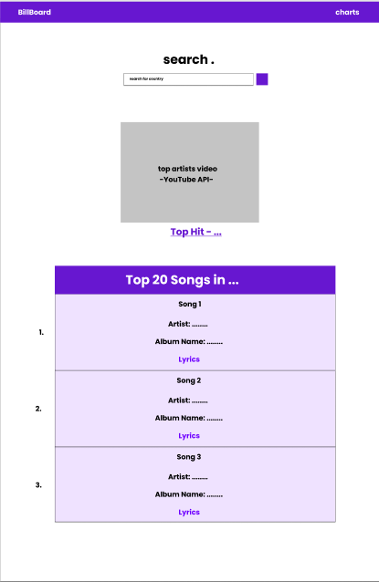
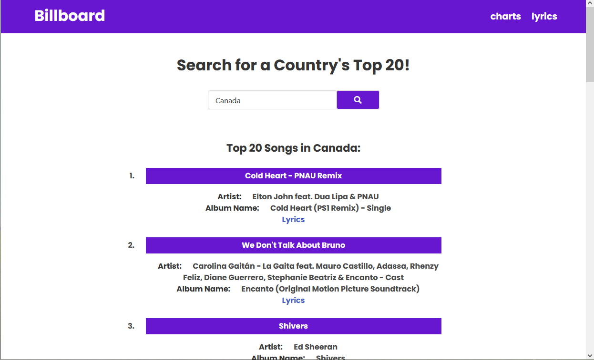

# Project 1: Billboard Search App

## Description

The Billboard Search App enables users to search for the top songs by country. First the user will enter in a country they want. If the user does not input a valid country, a modal window reminds them to input one, then prompt them to search again. It will then show them the top 20 songs of the searched country. The user can then click on the picture/name of the song and a video link and thumbnail of the music video will be showed for them.

## User Story

```
AS A music enthusiast
I WANT to see the top 20 songs for a specific country
AND see the album name, artist, and a link to the lyrics and the YouTube video
SO THAT I can see what kind of music is popular for the country I chose
```

## Motivation for development

We wanted to integrate Youtube and Top Charts/Lyrics in one convenient way.

## APIs Used:

1. MusiXMatch API (https://developer.musixmatch.com/)
2. Youtube API (https://www.youtube.com/yt/dev/api-resources.html)
3. Bulma CSS Framework (https://bulma.io/)
4. jQuery (https://jquery.com/)
5. FontAwesome (https://fontawesome.com/)
6. Cors Anywhere (Heroku app) (https://cors-anywhere.herokuapp.com/) for API testing

## Link to Deployed Application

> Repository Link: https://github.com/nevan-dsouza/billboard
>
> Deployed Site Link: https://nevan-dsouza.github.io/billboard/

## Application Wireframe




## Screenshot of Application in Use


## Rough Breakdown of Tasks

* Create a skeleton HTML
* Create custom CSS styling for the page (using bulma)
* Code a functional search bar
* Code container with the youtube video and the song title
* Code the list container with event listeners that change the youtube video container
* Code storage of last searched item and display it the next time user visits website
* Code modal window giving error if user does not input a valid country name

## Potential Future Features

 Potential features can include:
 * Filters for searching (artist, genre, etc.)
 * Displaying top artists instead of the top songs (if user toggles this feature)
 * Sort filter for displaying results (most viewed video, recently published, artist, etc.)
 * Display more information regarding countries that don’t have top 20 songs
 * Carousel of globally trending artists and songs
 * About Us page
 * Better aesthetic and minimalist design
 * Transitions and animations of different sections of the application
