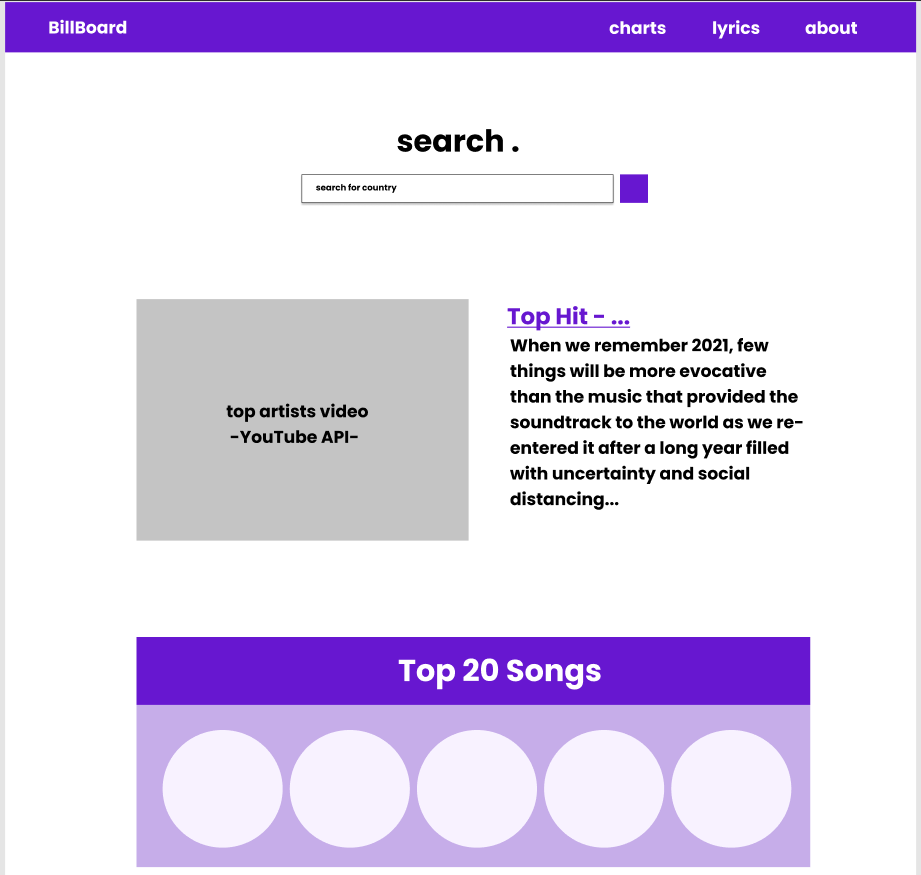

# Project 1: Billboard Search App

## Description

The Billboard Search App enables users to search for the top songs by country. First the user will enter in what country's top songs they want. It will then show them the top 20 songs of the searched country. The user can then click on the picture/name of the song and a video of the song will be played for them.

## User Story

```
AS A music enthusiast
I WANT to see the top songs in Billboard
SO THAT I can see what kind of music is popular for a country of my choosing
```

## APIs to be Used:

1. MusiXMatch API (https://developer.musixmatch.com/)
2. Youtube API (https://www.youtube.com/yt/dev/api-resources.html)
3. Bootstrap (https://getbootstrap.com/)
4. jQuery (https://jquery.com/)

## Application Wireframe


## Rough Breakdown of Tasks

* Create a skeleton HTML
* Create custom CSS styling for the page (used with bootstrap)
* Code a functional search bar
* Code container with the youtube video and the song title
* Code the list container with event listeners that change the youtube video container
* Code storage of last searched item and display it the next time user visits website

## Potentual Future Features

 Potential features can include:
 * Filters for searching (artist, genre, etc.)
 * Displaying top artists on the page alonside the top songs
